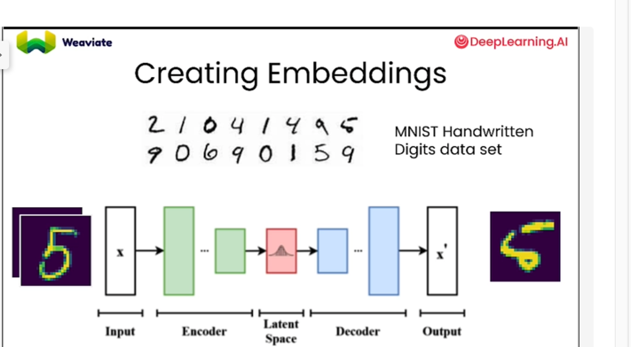

# Neural Networks and how it is used to fetch the  vector representation data.

Euclidean Distance -  Distance between 
Manhattan Distance
Dot Prodict
Cosine Distance -  Similar vectors will have very less distance
Sentence Embedders -

Navigable Small World.

Sparse search -  keyword search.

Dense vs sparse vs hybrid search. Can this be used in any other vector database offering to provide more concise results
for search criteria.

Retrieval Augmented Generation

When to use prompt engineering and when to use RAG and when to use both of them.

Reward Hacking - = Nonsensical data 

What is softmax layer in LLM?

RLHF +PEFT ---> Best use of reduced memory footprint.

Reward Model in RHLF

PPO --> Proximal Policy Optimization.

Policy Los is optimization.

What is entropy? in terms of AI/Reinforcement Learning.

Higher entropy
